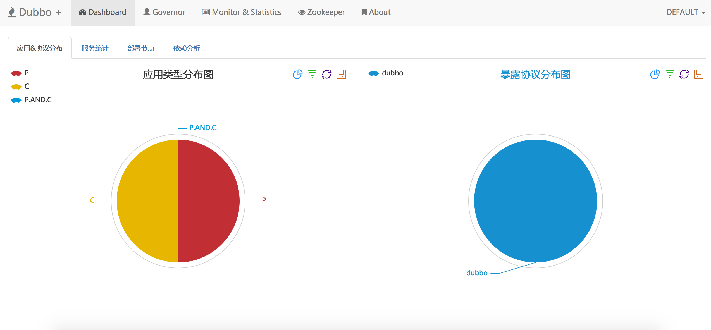

# dubbo-plus

## 1 Features
### 1.1 基于DubboKeeper进行改造开发

+ 页面说明优化，直观易理解
+ 项目结构整合，简单化

## 2 TODO

+ Dubbo暴露端口随机化
+ 支持分布式事务
+ 支持RateLimiter限流
+ 支持JDK信号量Semaphore控制
+ 支持分布式限流
+ 支持服务熔断隔离
+ 支持服务降级
+ 支持根据业务错误码进行重试
+ 支持JWT身份认证

## 3 治理端

